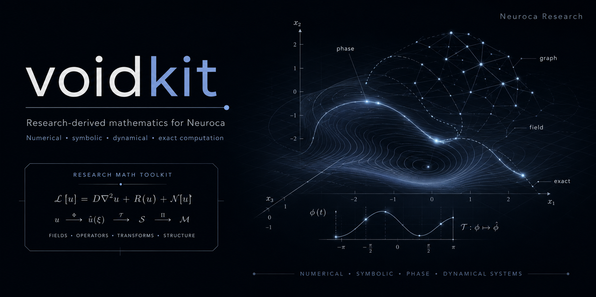

**Research-derived mathematics for Neuroca.**

VoidKit is a growing scientific-computing and mathematics library built from the reusable mathematical machinery developed across Neuroca research.

It is broader than any one theory or model. **VDM is one source family, not the definition of the package.** Phase Calculus is another major research line, and many tools in VoidKit are intended to stand independently as numerical, algebraic, statistical, geometric, graph, dynamical, symbolic, or exact-computation utilities.

The project exists to turn research code into durable tools **without erasing where the mathematics came from or what made an implementation distinctive**.

> **Current status:** early development / active extraction. The repository is usable as a research library, but the public API is not yet stable and substantial material is still being reconciled from the mining corpus.

## Why VoidKit exists

Research tends to produce useful mathematics in inconvenient places: experiment scripts, validators, derivation notebooks, one-off solvers, native kernels, symbolic audits, and prototype implementations.

VoidKit is the refinery for that material.

The goal is to recover useful mathematical capability and give it a clean, tested, discoverable home while preserving:

- the original mathematical contract and assumptions;
- authored mechanism and method identity;
- derivational and implementation provenance;
- exact arithmetic, invariants, certificates, and validation gates when they matter;
- alternate Python, Rust, C, assembly, and symbolic implementations when they provide independent evidence or performance value;
- uncertainty honestly, including cases where novelty or canonical status is still being assessed.

A familiar-looking implementation is not automatically redundant. A research-derived method is compared on its actual mathematics, algorithm, evidence, and behavior before it is generalized, replaced, or retired.

## Scope

VoidKit is being developed as a broad mathematics and scientific-computing library. Current and planned capability families include:

| Area | Examples |
|---|---|
| **Numerical methods** | root finding, interval certification, ODE/PDE methods, spectral operators, exact finite-time flows |
| **Exact & discrete mathematics** | permutations, free groups, Heisenberg structure, arbitrary-width arithmetic, Fibonacci/balanced refinement |
| **Dynamical systems** | nonlinear flows, reaction-diffusion, finite-relaxation transport, sparse/asynchronous fields |
| **Graphs & networks** | propagation diagnostics, causal/event structures, matching, spectral tools, sparse field dynamics |
| **Statistics & information** | correlated-series statistics, heavy-tail analysis, divergence and information measures |
| **Geometry & topology** | symbolic geometry, lattice/refinement tools, topology, recurrence and structural diagnostics |
| **Wave & field methods** | Klein-Gordon tools, pseudospectral methods, conservation/Noether diagnostics |
| **Symbolic & certification tools** | symbolic identity checks, algebraic-root certification, enumerative/symbolic search |
| **VDM** | authored VDM mechanisms and mathematics, including SIE and RE-VGSP, kept under their own identity |
| **Phase Calculus** | QBL, Orthad, exact coordinates, transport, FQM/cocycle machinery, certificates, native kernels, and Phase-native computation such as the π spigot/streamer family |

This list describes the project direction, not a claim that every listed capability is already merged into the public API.

## Research custody

VoidKit follows a few strict rules:

1. **Portable does not mean generic.** A method can be reusable outside its parent research program and still remain an authored method.
2. **Generalization is additive.** If a generic primitive can be extracted from an authored mechanism, the primitive may be exposed separately without replacing the authored object.
3. **Novelty is not a packaging gate.** Some items are known methods, some are distinctive implementations, and some may warrant novelty review. Unassessed novelty does not block preservation, testing, or use.
4. **Source semantics outrank cleanup convenience.** API cleanup does not authorize changing equations, branch behavior, certificates, invariants, or other load-bearing mathematics.

The detailed mining and custody rules live in [`MATH_MINING_TODO.md`](MATH_MINING_TODO.md).

## Current development state

VoidKit is currently at **v0.1.x** and should be treated as an evolving research library.

The active math-mining ledger tracks **326 retained code/support sources** from the current VDM Math Mining v3 corpus. Those sources range from general-purpose mathematical utilities to large Phase Calculus families, native kernels, VDM mechanisms, symbolic verification code, and research implementations still awaiting reconciliation.

A few important consequences:

- APIs may move while the package is being organized by mathematical ownership.
- `voidkit.vdm` is reserved for VDM-specific authored mechanisms and mathematics.
- `voidkit.phase_calculus` is the dedicated Phase Calculus namespace and is still being populated from canonical research sources.
- historically useful but non-canonical VDM experiments may be retained under `voidkit.vdm.easter_eggs`.
- mining archives under `sources/` are provenance/research material, not automatically public API.

For the current extraction state and planned work, see [`MATH_MINING_TODO.md`](MATH_MINING_TODO.md).

## Installation

VoidKit is not currently presented as a stable PyPI release. Install it from the repository while the API is under active development.

```bash
git clone https://github.com/Neuroca-Inc/voidkit.git
cd voidkit

python -m venv .venv
source .venv/bin/activate

python -m pip install --upgrade pip
python -m pip install -e .
```

Optional dependency groups can be installed as needed:

```bash
python -m pip install -e ".[symbolic]"
python -m pip install -e ".[graphs]"
python -m pip install -e ".[tda]"
```

Python 3.9+ is currently supported by the package metadata.

## A small current example

The repository already includes conventional utilities alongside research-derived mathematics:

```python
from voidkit.advanced_math import descriptive_stats

data = [1, 2, 3, 4, 5]
stats = descriptive_stats(data, ddof=1)

print(stats["mean"])
print(stats["std"])
```

Current CLI entry points include:

```bash
voidkit-stats 1 2 3 4 5 --json
voidkit-diff "sin(x)**2 + x**3" --var x --order 1
```

VDM-specific entry points and APIs live under `voidkit.vdm`. Phase Calculus APIs will live under `voidkit.phase_calculus` as canonical implementations are promoted from the research corpus.

## Package map

The repository is intentionally broader than the original VDM-oriented README suggested.

```text
voidkit/
├── advanced_math/
├── causal_inference/
├── clustering/
├── dynamical_systems/
├── evolutionary/
├── fractal_analysis/
├── fractional_calculus/
├── graph/
├── iit/
├── info_theory/
├── neuro/
├── numerical/
├── optimization/
├── ot/
├── pathway_analysis/
├── phase_calculus/
├── rmt/
├── sde/
├── semantic/
├── soc_analysis/
├── spatial/
├── stochastic/
├── structural_plasticity/
├── symbolic/
├── tda/
├── thermodynamics/
├── time_series/
└── vdm/
```

The exact module organization will continue to improve as mined capabilities are reconciled and promoted.

## Python and Rust

VoidKit currently has both Python and Rust source trees.

Python is the primary public research interface today. Rust is used for high-performance implementations and native counterparts where appropriate. The mining corpus also contains C and assembly implementations that may be promoted when they have a clear mathematical/API role and verification path.

See [`RUST_README.md`](RUST_README.md) for the current Rust-side notes.

## Roadmap

The repository-wide math roadmap is maintained in:

**[`MATH_MINING_TODO.md`](MATH_MINING_TODO.md)**

That document tracks:

- every retained item in the current mining corpus;
- implementation status;
- intended destination;
- research/custody rules;
- known source gaps;
- Phase Calculus recovery targets;
- already-extracted work that still needs to be merged;
- items requiring deeper mathematical or novelty assessment.

The TODO is deliberately exhaustive so valuable research code does not disappear simply because it was buried in an old experiment or had an unfamiliar name.

## Repository philosophy

VoidKit is not intended to become a pile of thin wrappers around existing libraries.

Standard mathematics belongs here when a centralized, tested implementation is useful. Distinctive research implementations belong here when they provide something worth preserving: a derivation, algorithm, invariant, exact construction, certification path, performance characteristic, unusual composition, or other real capability.

The standard is usefulness plus mathematical custody, not novelty theater and not reinvention for its own sake.

## License

VoidKit is distributed under the repository's dual research/commercial license.

The license is intended to support open academic research while reserving commercial use for written permission. See [`LICENSE`](LICENSE) for the controlling terms.

## Neuroca

VoidKit is developed under **Neuroca, Inc.**, whose research program centers on neuro-cognitive architectures and the mathematical/computational systems that support them.

Repository: https://github.com/Neuroca-Inc/voidkit

---

Copyright © 2025 Justin K. Lietz, Neuroca, Inc. All Rights Reserved.
